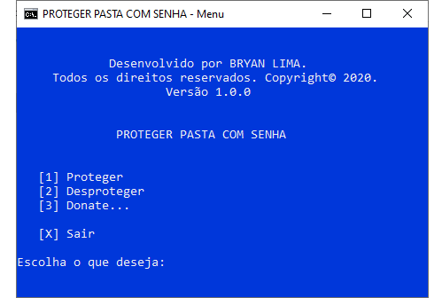

# Password Protect Folder

  

Proteja sua pasta com uma senha local para manter o conteúdo da pasta longe de interesseiros como familiares e amigos.

_**Importante**: Sua senha **não** é enviada ou armazenada externamente. Tudo ocorre localmente, ou seja, apenas na sua máquina._

## Screenshots

Abaixo, segue algumas imagens do programa.

## Como usar

Faça o download deste repositório, procure pelo arquivo **``"protect-folder-vX.X.X.bat"``** e execute-o como um **``*.bat``** qualquer, não há necessidade de executá-lo como administrador. Após, basta escolher as opções disponíveis na tela. O uso em si, é intuitivo.

## Problemas?

Se estiver enfrentando algum problema ao usar o [**Password Protect Folder**](https://github.com/bryan-lima/password-protect-folder), me informe criando um **_issue_** neste repositório GitHub. Ah, não se esqueça de inserir *prints* do erro.

## Donate

Se te ajudei de alguma forma, considere me pagar um café como agradecimento.

## Licença

O projeto **Password Protect Folder** é licenciado sob [MIT License](https://opensource.org/licenses/MIT).

## Autor

Este projeto foi desenvolvido por [**Bryan Lima**](https://github.com/bryan-lima) para finalidade de estudos, e disponibilizado ao público para que possam usar, testar, fornecer feedback e contribuir para melhorias do projeto.